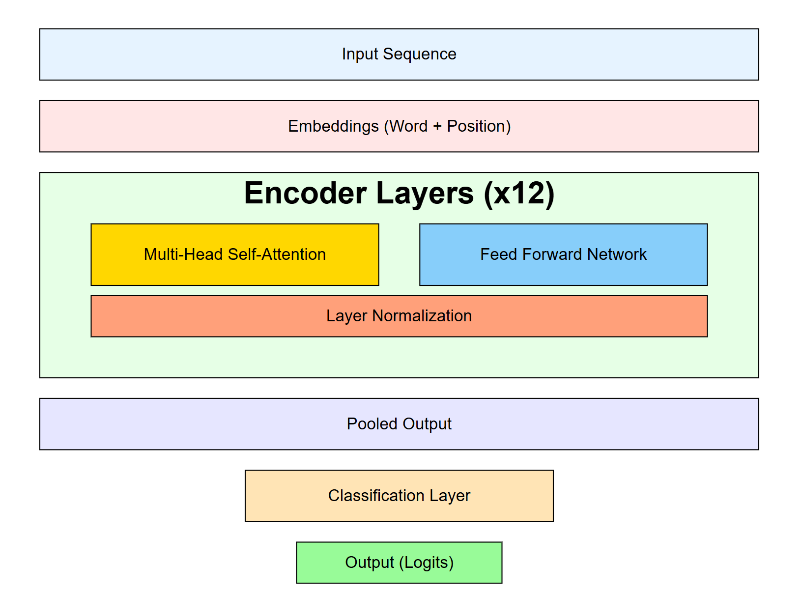
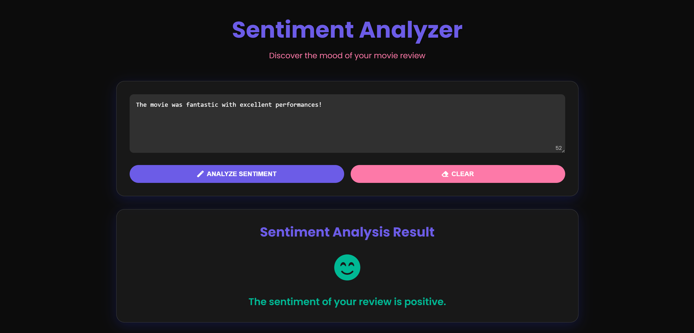
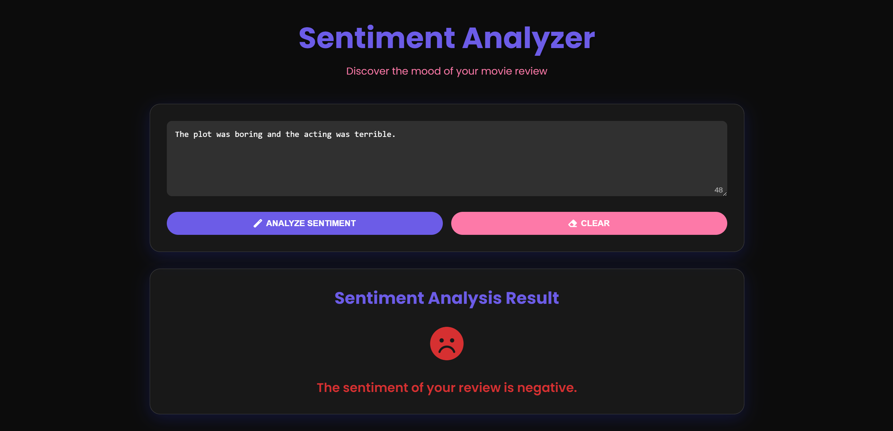
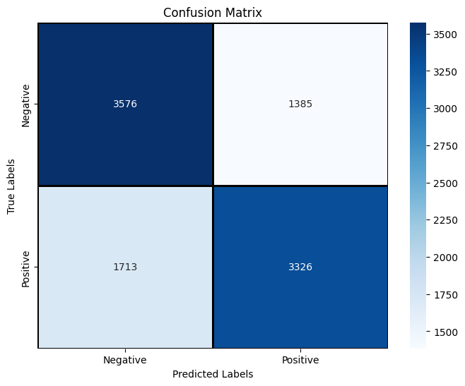

# Sentiment Analysis with BERT: IMDB Movie Review Classifier

This project demonstrates a sentiment classification model that classifies IMDB movie reviews as **positive** or **negative** using **BERT** (Bidirectional Encoder Representations from Transformers). The goal is to leverage the BERT transformer architecture to build a robust sentiment classifier for movie reviews, showcasing state-of-the-art results in natural language understanding.

## Table of Contents

- [Project Overview](#project-overview)
- [Model Architecture](#model-architecture)
- [Technologies Used](#technologies-used)
- [Installation](#installation)
- [Training the Model](#training-the-model)
- [Evaluating the Model](#evaluating-the-model)
- [Running the FastAPI Application](#running-the-fastapi-application)
- [Web Interface](#web-interface)
- [Results](#results)
- [References](#references)

## Project Overview

Sentiment analysis is a widely-used task in natural language processing (NLP) that involves classifying the sentiment of a given text. This project implements a sentiment classifier to determine whether an IMDB movie review is **positive** or **negative** using BERT.

This project is divided into several components:
- **Model Training and Evaluation** (`classifier.ipynb`): Training the BERT model on labeled IMDB data and evaluating the performance of the classifier.
- **FastAPI Application** (`main.py`): A REST API built using FastAPI for deploying the model, where users can submit a review and get predictions in real-time.
- **Frontend UI** (`index.html`, `style.css`, `script.js`): A modern and intuitive web interface where users can input a movie review and classify it as positive or negative.

## Model Architecture

This project employs the **BERT** architecture, which has several key advantages for NLP tasks like sentiment classification:
1. **Bidirectional Contextualization**: BERT uses a bidirectional transformer, enabling it to understand context from both directions (left and right) of a word in a sentence.
2. **Pre-trained Model Fine-tuning**: The model is first pre-trained on a large corpus and then fine-tuned on the IMDB movie review dataset, allowing it to leverage a wide understanding of the language while adapting to specific tasks.
3. **Attention Mechanism**: The transformer architecture, which BERT is based on, makes use of self-attention to capture long-range dependencies in the text.

The training, evaluation, and fine-tuning processes are carried out in `classifier.ipynb`.



## Technologies Used

- **Python**: Main programming language for model training and backend.
- **PyTorch**: Deep learning framework used for building the BERT model.
- **Transformers**: Hugging Face's library for accessing pre-trained BERT models and tokenizers.
- **FastAPI**: Lightweight and fast web framework to serve the model.
- **HTML, CSS, JavaScript**: Frontend development for user interaction.
- **Jupyter Notebook**: For model training and evaluation.
- **Seaborn**: For visualizing evaluation metrics.

## Installation

### Requirements

- Python 3.10+
- `pip` for package management

### Steps

1. Clone the repository:

    ```bash
    git clone https://github.com/yourusername/bert-sentiment-analysis.git
    cd bert-sentiment-analysis
    ```

2. Install dependencies:

    ```bash
    pip install -r requirements.txt
    ```

## Training the Model

1. Open the `classifier.ipynb` notebook in Jupyter Notebook or JupyterLab.
   
2. Prepare the data by loading the IMDB dataset:
   - **IMDB Dataset**: The dataset is already pre-processed and tokenized using the `BertTokenizer`.
   - **Encoding**: Use the tokenizer to transform reviews into BERT-compatible input encodings.
   
3. **Training**: 
   - Fine-tune the BERT model on the training dataset.
   - The notebook provides the full training loop, which includes:
     - Data loading with `DataLoader`.
     - Optimization and loss function setup using `AdamW` and cross-entropy loss.
     - Scheduler for layer-wise learning rate decay
     - Gradient accumulation for handling smaller batches.

4. **Evaluation**:
   - The notebook also includes a section to evaluate the model's performance using classification metrics like **accuracy**, **precision**, **recall**, and **F1 score**.
   - The evaluation section includes a confusion matrix and classification report.

5. **Saving the Model**:
   After training, the model is saved using `torch.save()` for future inference:
   
   ```python
   torch.save(model.state_dict(), "bert_imdb_model.pth")
   ```

## Evaluating the Model

To evaluate the model on the test set:

1. Open the `classifier.ipynb` notebook and run the evaluation cells.
   
2. The notebook provides the following:
   - **Confusion Matrix**: A gradient-colored confusion matrix to visually assess performance.
   - **Classification Report**: Detailed performance metrics including precision, recall, and F1 score.

## Running the FastAPI Application

To serve the model via FastAPI:

1. Ensure the trained model weights (`bert_imdb_model.pth`) are in the same directory as `main.py`.

2. Run the FastAPI application:

    ```bash
    uvicorn main:app --reload
    ```

3. The FastAPI app will be served at `http://127.0.0.1:8000/`

## Web Interface

The project includes a modern and intuitive frontend web interface built using HTML, CSS, and JavaScript. You can interact with the model by submitting a review and getting an instant sentiment classification.

To view the web interface:

1. After running the FastAPI app, open your browser and go to `http://127.0.0.1:8000/`.

2. You will see a multi-line input box where you can submit your movie review. Click on the **Classify** button to get the sentiment prediction.

3. The page also has a **Clear** button to reset the input box for new reviews.




## Results

### Evaluation Metrics

The model performs as follows on the test set:

- **Accuracy**: `69.02%`
- **Precision (Positive)**: `70.60%`
- **Precision (Negative)**: `67.61%`
- **Recall (Positive)**: `66.01%`
- **Recall (Negative)**: `72.08%`
- **F1 Score (Positive)**: `68.23%`
- **F1 Score (Negative)**: `69.78%`

### Confusion Matrix

A confusion matrix was plotted using `seaborn` to visualize how well the model classified positive and negative reviews.



## References

- [BERT: Pre-training of Deep Bidirectional Transformers for Language Understanding](https://arxiv.org/abs/1810.04805)
- [FastAPI Documentation](https://fastapi.tiangolo.com/)
- [Transformers by Hugging Face](https://huggingface.co/transformers/)